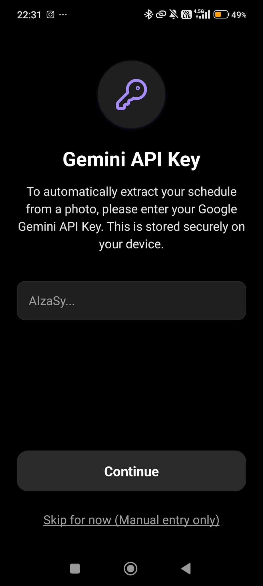
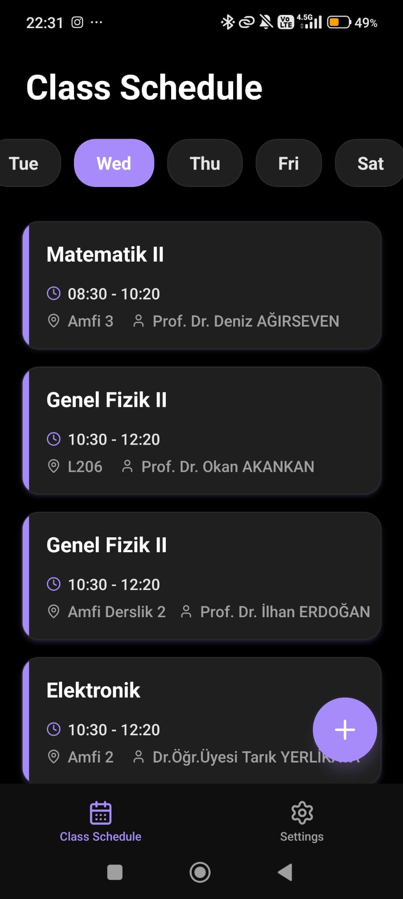
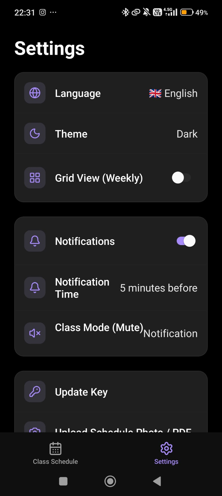
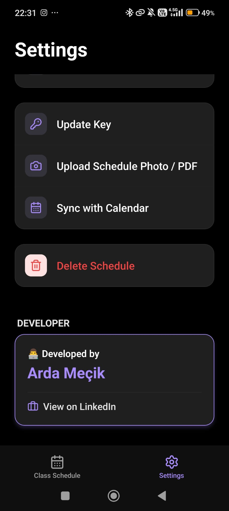
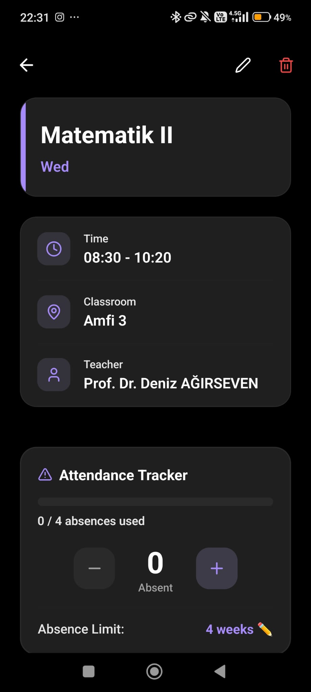

# 📚 Class Reminder — AI-Powered Class Schedule & Reminder App

<div align="center">

**An elegant, premium, cross-platform mobile app that ensures students never miss a class.**

Built with **React Native** · **TypeScript** · **Expo SDK 54** · **Google Gemini 2.0 Flash AI**

[](LICENSE)
[](https://expo.dev)
[](#)

</div>

---

## 📸 Screenshots

<div align="center">
<table>
  <tr>
    <td align="center"><strong>API Key Setup</strong></td>
    <td align="center"><strong>Daily Schedule View</strong></td>
    <td align="center"><strong>Settings Page</strong></td>
  </tr>
  <tr>
    <td></td>
    <td></td>
    <td></td>
  </tr>
  <tr>
    <td align="center"><strong>Settings (AI & Sync)</strong></td>
    <td align="center"><strong>Class Detail & Attendance</strong></td>
    <td></td>
  </tr>
  <tr>
    <td></td>
    <td></td>
    <td></td>
  </tr>
</table>
</div>

---

## ✨ Key Features

### 🤖 AI-Powered Timetable Scanner
- **Zero Manual Entry**: Upload a photo or PDF of your printed/digital class schedule.
- **Google Gemini 2.0 Flash Integration**: The AI analyzes the image and extracts course names, lecturers, classrooms, days, and time slots automatically.
- **Multi-Format Support**: Accepts JPEG/PNG images from gallery and PDF documents from file manager.

### 🔔 Smart Notification System
- **Pre-Class Reminders**: Configurable alerts 5, 10, 15, 20, or 30 minutes before each class.
- **Class Mode (Mute Reminder)**: Sends a notification exactly when class starts reminding you to silence your phone. Three modes available:
  - `Off` — Disabled
  - `Notification` — Simple reminder notification
  - `Settings Shortcut` — Tapping the notification opens Android Sound Settings directly
- **Attendance Check**: Automatic notification at the end of each class asking *"Did you attend today?"*
- **Offline First**: All notifications are scheduled locally — no server required.

### 📉 Attendance Tracker
- **Track Absences Per Class**: Each class detail page includes a dedicated attendance card with `+` / `−` buttons.
- **Visual Progress Bar**: Color-coded progress indicator:
  - 🟢 **Normal** (purple) — Under 75% used
  - 🟡 **Warning** (yellow) — 75%+ absences used
  - 🔴 **Danger** (red) — Limit exceeded with **"LİMİT AŞILDI!"** alert
- **Editable Limits**: Tap the limit to customize it per class (default: 4 weeks).

### 📅 Weekly Grid View
- **Timetable Grid**: Toggle between the daily list view and a beautiful **Monday–Friday hourly grid** showing all classes as positioned time blocks.
- **Smart Overlap Handling**: Overlapping classes are cascaded with solid backgrounds and shadows for clear visibility.
- **Toggle in Settings**: Switch between views anytime from the Settings page.

### 🗓️ Calendar Sync (Google / Apple Calendar)
- **One-Tap Export**: Sync your entire schedule to any writable calendar on your phone (Google Calendar, Samsung Calendar, Apple Calendar, etc.).
- **Calendar Picker**: Choose which calendar to sync to from a list of available calendars.
- **16-Week Recurring Events**: Classes are added as weekly recurring events for an entire semester.

### 🖼️ Android Home Screen Widget
- **"Next Class" Widget**: Displays your upcoming class name, time, and room directly on your Android home screen.
- **Auto-Updates**: Widget refreshes automatically whenever you add, edit, or delete a class.
- ⚠️ *Requires a native build (APK/AAB) — not available in Expo Go.*

### 🔐 Secure Key Storage (BYOK)
- **Bring Your Own Key**: Users enter their own Google Gemini API key during onboarding.
- **Hardware-Backed Encryption**: API keys are stored securely using iOS Keychain / Android Keystore via `expo-secure-store`.
- **Updatable**: Change your API key anytime from Settings.

### 🎨 Premium Glassmorphism Design
- **Dark & Light Themes**: Sleek charcoal dark mode with neon purple glows, or elegant lavender-white light mode.
- **Blur Effects**: iOS-style `expo-blur` glass cards on the tab bar.
- **System Preference Sync**: Automatically follows your device's theme preference.

### 🌍 Bilingual Support (TR / EN)
- **Turkish & English**: Fully localized UI using `i18next` and `react-i18next`.
- **Auto-Detection**: Detects device locale via `expo-localization` to set the default language.

---

## 🏗️ Architecture & Project Structure

Built with **Expo Router v3** (file-based navigation), React Context for state management, and modular service layers.

```bash
class-reminder/
├── app/                        # Expo Router Screens
│   ├── (tabs)/                 # Main Tab Navigator
│   │   ├── _layout.tsx         # Tab bar config with blur effects
│   │   ├── home.tsx            # Daily list view + Weekly grid view toggle
│   │   └── settings.tsx        # All preferences & feature controls
│   ├── onboarding/             # First-run setup flow
│   │   ├── welcome.tsx         # App introduction
│   │   ├── language.tsx        # Language selector
│   │   ├── theme.tsx           # Theme picker
│   │   ├── api-key.tsx         # Gemini API key entry
│   │   └── schedule-setup.tsx  # Upload or manual entry choice
│   ├── class/
│   │   └── [id].tsx            # Class detail + Attendance tracker
│   ├── add-class.tsx           # Manual class creation form
│   ├── scan-result.tsx         # AI scan preview & import
│   └── _layout.tsx             # Root layout with providers
├── src/
│   ├── components/             # Reusable UI components
│   │   ├── ClassCard.tsx       # Class list item card
│   │   ├── DaySelector.tsx     # Horizontal day tabs
│   │   ├── WeeklyGridView.tsx  # Weekly timetable grid
│   │   └── DeveloperCredit.tsx # Footer credit component
│   ├── contexts/               # React Context providers
│   │   ├── ThemeContext.tsx     # Dark/Light theme management
│   │   ├── LanguageContext.tsx  # i18n language management
│   │   └── ScheduleContext.tsx  # Class CRUD + widget updates
│   ├── services/               # Business logic services
│   │   ├── gemini.ts           # Gemini 2.0 Flash API integration
│   │   ├── notifications.ts   # Notification scheduling engine
│   │   ├── calendarSync.ts    # Calendar export & sync service
│   │   └── secureStorage.ts   # Secure key read/write wrapper
│   ├── i18n/                   # Localization files
│   │   ├── en.json             # English translations
│   │   ├── tr.json             # Turkish translations
│   │   └── index.ts            # i18n initialization
│   ├── themes/                 # Color tokens & gradients
│   ├── types/                  # TypeScript interfaces
│   └── utils/                  # Constants & helpers
├── widget/                     # Android Home Screen Widget
│   ├── NextClassWidget.tsx     # Widget UI component
│   └── WidgetTaskHandler.tsx   # Widget background update logic
├── app.json                    # Expo config & native plugins
├── package.json                # Dependencies & scripts
└── tsconfig.json               # TypeScript config
```

---

## 📊 Data Model

### `ClassSession` Interface

```typescript
export interface ClassSession {
  id: string;          // Unique UUID
  courseName: string;  // e.g., "Advanced Calculus"
  teacher?: string;    // e.g., "Prof. Dr. Deniz AĞIRSEVEN"
  classroom?: string;  // e.g., "Amfi 3"
  day: number;         // 0-6 (0 = Monday, 6 = Sunday)
  startTime: string;   // "HH:MM" format (24h)
  endTime: string;     // "HH:MM" format (24h)
  notes?: string;      // Optional student notes
  absences?: number;   // Number of absences recorded
  absenceLimit?: number; // Max absences allowed
}
```

---

## 🚀 Getting Started

### Prerequisites
- **Node.js** v18 or above
- **Expo Go** app on your Android/iOS device ([Play Store](https://play.google.com/store/apps/details?id=host.exp.exponent) / [App Store](https://apps.apple.com/app/expo-go/id982107779))
- A **Google Gemini API Key** (free from [Google AI Studio](https://aistudio.google.com/apikey))

### 1. Clone & Install

```bash
git clone https://github.com/mecik-arda/class-reminder.git
cd class-reminder
npm install
```

### 2. Start Development Server

```bash
npx expo start
```

### 3. Connect Your Device
- **Android**: Open Expo Go → Scan the QR code from terminal
- **iOS**: Open Camera → Scan the QR code → Open in Expo Go
- ⚠️ Both devices must be on the **same Wi-Fi network**

### 4. Get Your API Key
1. Go to [Google AI Studio](https://aistudio.google.com/apikey)
2. Create a free API key
3. Enter it in the app during onboarding or in Settings → Update Key

---

## 🔒 Permissions

| Permission | Platform | Purpose |
|---|---|---|
| Camera | Android / iOS | Scan class schedules via camera |
| Photo Library | Android / iOS | Upload schedule images from gallery |
| Notifications | Android / iOS | Class reminders & attendance checks |
| Exact Alarm | Android | Precise notification scheduling |
| Calendar | Android / iOS | Sync schedule to device calendar |

---

## 🛠️ Tech Stack

| Technology | Purpose |
|---|---|
| React Native 0.81 | Cross-platform mobile framework |
| Expo SDK 54 | Development & build toolchain |
| TypeScript | Type-safe codebase |
| Expo Router v3 | File-based navigation |
| Google Gemini 2.0 Flash | AI vision for schedule extraction |
| expo-notifications | Local push notification scheduling |
| expo-secure-store | Hardware-backed key encryption |
| expo-calendar | Native calendar integration |
| expo-blur | iOS glassmorphism effects |
| react-native-android-widget | Android home screen widget |
| i18next | Internationalization (TR/EN) |
| AsyncStorage | Local data persistence |

---

## 👨‍💻 Developer

**Arda Meçik**

- GitHub: [@mecik-arda](https://github.com/mecik-arda)

---

## 📄 License

This project is licensed under the **MIT License** — see the [LICENSE](LICENSE) file for details.
